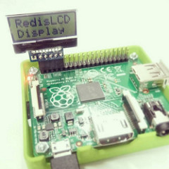

redis-lcd-display.c
====

Display driver program for AQM0802A module

- https://www.switch-science.com/catalog/1516/
- http://akizukidenshi.com/catalog/g/gP-06669/

Setup
----
    $ sudo raspi-config
      // 1. select "8 Advanced Options"→"A7 I2C"
      // 2. "Would you like the ARM I2C interface to be enabled?" -> yes
      // 3. "Would you like the I2C kernel module to be loaded by default?" -> yes
      // 4. quit raspi-config
    $ reboot

    $ sudo apt-get install redis-server
    $ sudo apt-get install git-core
    $ mkdir -p ~/work
     
    $ cd ~/work
    $ git clone git://git.drogon.net/wiringPi
    $ cd wiringPi
    $ ./build
     
    $ cd ~/work
    $ git clone https://github.com/redis/hiredis.git
    $ cd hiredis
    $ make
    $ sudo make install
     
    $ sudo ldconfig

Compile & Run
----

    $ cd ~/work
    $ git clone https://github.com/yoggy/redis-lcd-display.git
    $ cd redis-lcd-display
      
    $ make
    $ sudo ./redis-lcd-display

How to use
----

    // normal messages 
    $ redis-cli set "lcd:0" "RedisLCDDisplay"
    OK
    $ redis-cli set "lcd:1" "`date +'%m/%d   %H:%M'`"
    OK
    $ redis-cli set "lcd:2" `LANG=C /sbin/ifconfig | grep -v 127.0.0.1 | grep inet | awk '{print $2}' | sed -e 's/addr://'`
    OK
    
    // error message
    $ redis-cli set "lcd:err" "err: error string..."
    OK
    $ redis-cli expire "lcd:err" 10
    OK

Copyright and license
----

Copyright (c) 2015 yoggy

Released under the [MIT license](LICENSE.txt)

